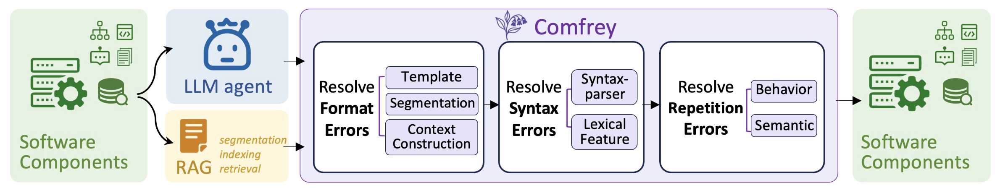

<div align="center">
    
<div align="center">
    
</div>

# Comfrey: Mitigating Integration Failures in LLM-enabled Software at Run-Time

[](https://opensource.org/licenses/MIT)
[](https://www.python.org/)

</div>

Artifact for the paper 'Comfrey: Mitigating Integration Failures in LLM-enabled Software at Run-Time'.


## Table of Contents

- [Comfrey: Mitigating Integration Failures in LLM-enabled Software at Run-Time](#comfrey-mitigating-integration-failures-in-llm-enabled-software-at-run-time)
  - [Overview](#overview)
  - [Architecture](#architecture)
    - [Stage 1: Format Error Resolution](#stage-1-format-error-resolution)
    - [Stage 2: Syntax Error Resolution](#stage-2-syntax-error-resolution)
    - [Stage 3: Repetition Error Resolution](#stage-3-repetition-error-resolution)
  - [Usage](#usage)
    - [Use as Decorator for LLM Component Functions](#use-as-decorator-for-llm-component-functions)
    - [Use as Decorator for RAG Generation Functions](#use-as-decorator-for-rag-generation-functions)
  - [Test Data](#test-data)
    - [Download Instructions](#download-instructions)
    - [Data Structure](#data-structure)

## Overview

Comfrey serves as the middle layer between AI components (LLM and RAG) and their downstream software components, automatically detecting and adapting the AI component outputs that violate the format, syntax, and repetition requirements.

<div align="center">
    
    <p>Overview of the run-time framework Comfrey</p>
</div>


## Architecture

The framework implements the three-stage workflow described in the paper:

### Stage 1: Format Error Resolution
- **Template discrepancy**: FSA validation with element threshold, element re-ordering, structure refinement, delimiter supplementation
- **Improper data segmentation**: Dictionary validation, syntactic tree analysis, fragment bridging, sliding-window re-segmentation  
- **Incorrect context construction**: Two-stage similarity detection, query-based relevance ranking, low-relevance entry removal

### Stage 2: Syntax Error Resolution
- **Syntax-parser misalignment**: Compiler/parser syntax validation, AST refinement with minimal edit distance
- **Inconsistent lexical features**: Language & structure examination, translation, grammar correction, structure standardization

### Stage 3: Repetition Error Resolution
- **Redundant software behavior**: History examination, invocation bypass
- **Redundant semantics**: Two-stage similarity detection, content de-duplication, loop termination and rollback

## Usage

```python
from src.comfrey_core import ComfreyFramework

# Initialize framework
comfrey = ComfreyFramework(config)

# Extract requirements from codebase
comfrey.extract_requirements_from_codebase(target_directory="./my_app")

# Use as decorator for LLM component functions
@comfrey
def my_llm_function(prompt):
    # Your LLM function here
    return llm_response

# Or process outputs directly
processed_output = comfrey._process_ai_output(llm_output, "function_name", args, kwargs)


# Use as decorator for RAG retrieval functions
@comfrey
def rag_retrieval_function(query, documents):
    # Your RAG retrieval function here
    # This could be a function that retrieves relevant documents
    # and constructs context for LLM
    retrieved_docs = retrieve_relevant_documents(query, documents)
    context = construct_context(retrieved_docs)
    return context

# Use as decorator for RAG generation functions
@comfrey
def rag_generation_function(query, context):
    # Your RAG generation function here
    # This could be a function that generates responses based on context
    response = generate_response_with_context(query, context)
    return response

# Process RAG outputs directly
processed_context = comfrey._process_ai_output(rag_context, "rag_retrieval", (query,), {})
processed_response = comfrey._process_ai_output(rag_response, "rag_generation", (query, context), {})
```

## Test Data

Due to the large size of test datasets (approximately 2.7GB), they are stored separately from the main repository.

### Download Instructions

Please download the test data from the GitHub releases page or use the direct links below:

- **Context QA Data** (715MB): Contains NarrativeQA and other context-based question answering datasets
  - Download: `context_qa_data.tar.gz`
  - Extract: `tar -xzf context_qa_data.tar.gz`

- **Conversational Agent Data** (12MB): Contains MultiWOZ datasets for dialogue systems
  - Download: `conversational_agent_data.tar.gz`
  - Extract: `tar -xzf conversational_agent_data.tar.gz`

- **Program Synthesis Data** (3.4MB): Contains MBPP, DS-1000, and APPS datasets
  - Download: `program_synthesis_data.tar.gz`
  - Extract: `tar -xzf program_synthesis_data.tar.gz`

- **Task Management Data** (41MB): Contains Taskmaster datasets for task-oriented dialogues
  - Download: `task_management_data.tar.gz`
  - Extract: `tar -xzf task_management_data.tar.gz`


