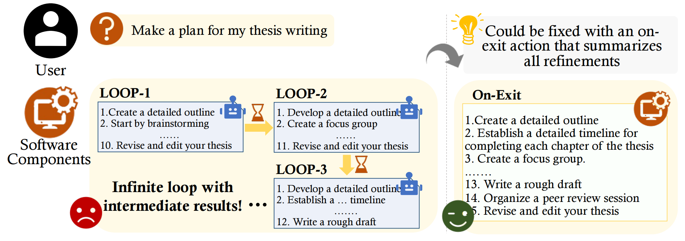

# README

  

This is the artifact for our ICSE2025 paper "[Are LLMs Correctly Integrated into Software Systems?](https://arxiv.org/abs/2407.05138)". It is publicly archived at [Figshare](https://figshare.com/articles/dataset/Hydrangea/28262426). This repository is made available under the Public Domain Dedication and License v1.0 whose full text can be found at: http://opendatacommons.org/licenses/pddl/1.0/ - see the [LICENSE](./LICENSE) file for details. If you have any questions, please feel free to contact me via email(ycshao@stu.ecnu.edu.cn).

We are grateful for the contribution made by our anonymous collaborator. The `defect.csv` file has been updated accordingly. You can review the latest updates!

Hydrangea is a defect library for LLM-enabled software. Hydrangea has 4 main petals, each corresponding to one of the major components where defects often arise: LLM agent, vector database, software component, and system.

## What is LLM-enabled software?

It is software that integrates LLMs (large language models) with RAG (retrieval-augmented generation) support to realize intelligence features.

It contains four components:

1. **LLM agent** that manages LLM interfaces, constructs prompts, and invokes the
   LLM
2. **Vector database** that supports RAG algorithm and enhances the LLM agent
3. **Software component** that interacts with the first two components to perform certain tasks
4. **System** that manages resources and privileges to carry out the execution

## What's inside the artifact:

For enhanced availability and reusability, we offer an organized defect library utilized in our manual studies.

Below are details of what is included in each part:

### Application benchmark
A suite of 100 non-trivial projects that tightly integrates LLMs and vector databases in their workflow.

We have uploaded `application.csv`, which contains:

   1. software project name
   2. GitHub link and commit ID
   3. classification
   4. used LLM and vector database

### Hydrangea Defect Library
The result of TABLE Ⅱ in our paper can be reproduced by this organized defect library. 

In the uploaded `defect.csv`, we have documented different cases for the same defect type, as defects can manifest in various ways. For each distinct case of the same defect, we have separated them with a blank line and labeled them as case 1, case 2, and so on, according to the specific circumstances.

It contains:

A collection of defects in these projects (involves 100 projects), containing
   1. the defect type and its detailed explanation
   2. the exact file and source-code line location of the defect
   3. the consequences of defect
   4. the defect-triggering tests

The meaning of different columns in `defect.csv`:
   1. **APP**: the applications from GitHub.
   2. **commit url**: the relevant version of the application on GitHub.
   3. **types**: different defect types.
   4. **cases**: different examples for each defect type. Cells containing a "/" indicate that there is only one case for that defect type.
   5. **explanation**: details of the defect.
   6. **consequences**: the impacts of the defect. Here we use the abbreviations: ST refer to fail-stops, IC refer to incorrectness, SL refer to slower execution, UI refer to unfriendly user interface, TK refer to more tokens, and IS refer to insecure.
   7. **source-code locations**: The location of the code file where the defect occurs.
   8. **defect-triggering tests**: The software input that triggers the defect.

## Quick Start-How to use Hydranger?

  

Take **LocalAGI** as an example. It makes plans to guide users to achieve their goals. However, due to its infinite loop design with time intervals, it repeatedly refines a subset of the generated steps, without providing a final version that contains all the refinements. Making things worse, this loop could only be broken by terminating the entire application, significantly degrading user experience.

### Tutorial
   1. Open `application.csv` to find the corresponding GitHub link and commit ID for this application.
   2. Review `defect.csv` to get an overview of the defect and the associated defect-triggering tests.
   3. You can attempt to reproduce the issue.
